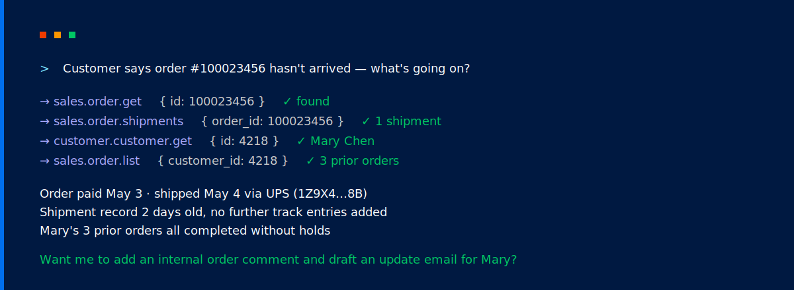

<p align="center">
  
</p>

# Magento 2 MCP module

Extensible [Model Context Protocol](https://modelcontextprotocol.io/specification/2025-06-18) server for Magento 2. Connect your store to any MCP-compatible AI agent — read and mutate customer, product, CMS or sales data, fetch reports, manage configuration, and more.

The base module ships the transport, authentication, ACL, audit log, and tool registry, plus a small set of system tools for inspecting and refreshing the store. Domain-specific functionality lives in optional sub-modules listed below — you can also write your own.

## Contents

- [What the base module gives you](#what-the-base-module-gives-you)
- [Installation](#installation)
- [Sub-modules](#sub-modules)
  - [Order module — `Magebit_McpOrderTools`](#order-module--magebit_mcpordertools)
  - [Catalog module — `Magebit_McpCatalogTools`](#catalog-module--magebit_mcpcatalogtools)
  - [Customer module — `Magebit_McpCustomerTools`](#customer-module--magebit_mcpcustomertools)
  - [CMS module — `Magebit_McpCmsTools`](#cms-module--magebit_mcpcmstools)
  - [Marketing module — `Magebit_McpMarketingTools`](#marketing-module--magebit_mcpmarketingtools)
  - [Report module — `Magebit_McpReportTools`](#report-module--magebit_mcpreporttools)
- [Setup](#setup)
- [Connecting an AI agent](#connecting-an-ai-agent)
  - [Bearer token](#bearer-token)
  - [OAuth 2.1](#oauth-21)
- [Security](#security)
- [Extending](#extending)
- [Contributing](#contributing)

## What the base module gives you

- A `POST /mcp` JSON-RPC endpoint with bearer-token and OAuth 2.1 authentication
- Per-tool admin-role ACL and a two-layer write kill-switch
- A PII-redacting audit log with configurable retention
- Per-(admin, tool) rate limiting
- An origin allowlist with sensible defaults for major AI clients
- Core tools for cache types, indexers, store views, system configuration values and admin notifications
- MCP prompt support (see examples in [Prompt/System](Prompt/System/) directory)

## Installation

```bash
composer require magebitcom/magento2-mcp-module
bin/magento module:enable Magebit_Mcp
bin/magento setup:upgrade
```

## Sub-modules

Each sub-module is published independently and depends on `Magebit_Mcp`. Install only the ones you need. After every `composer require` below, enable and rebuild Magento with:

```bash
bin/magento module:enable Magebit_Mcp<Name>Tools
bin/magento setup:upgrade
```

### Order module — `Magebit_McpOrderTools`
- Read and search orders, invoices, shipments, payments, order comments and credit memos
- Create invoices, shipments, shipment tracks, credit memos and order comments
- Cancel, hold or unhold orders

```bash
composer require magebitcom/mcp-module-order-tools
```

### Catalog module — `Magebit_McpCatalogTools`
- Read and search products and categories
- Create, update or delete products
- Create, update or delete categories

```bash
composer require magebitcom/mcp-module-catalog-tools
```

### Customer module — `Magebit_McpCustomerTools`
- Read or search customers, addresses and customer groups
- Fetch customer confirmation status
- Create, update or delete customers and addresses
- Trigger password reset or resend confirmation

```bash
composer require magebitcom/mcp-module-customer-tools
```

### CMS module — `Magebit_McpCmsTools`
- Read or search CMS pages and blocks
- Create, update or delete CMS pages and blocks

```bash
composer require magebitcom/mcp-module-cms-tools
```

### Marketing module — `Magebit_McpMarketingTools`
- Read or search catalog rules, cart rules and coupons
- Delete, toggle and apply catalog and cart rules
- Generate or delete coupon codes

```bash
composer require magebitcom/mcp-module-marketing-tools
```

### Report module — `Magebit_McpReportTools`
- Cart reports (products in cart, abandoned carts)
- Popular search queries and newsletter problems (bounces, send failures)
- Product reviews, review counts and average ratings
- Aggregated sales reports for orders, tax, invoices, shipments, refunds and coupons
- Customer reports (orders, totals, new customers, online visitors)
- Product reports (most viewed, bestsellers, low-stock, qty ordered, downloads)
- Dashboard summary (lifetime sales, average order, revenue for a period, recent orders, top search terms, top bestsellers)
- Refresh sales/customer/review statistics

```bash
composer require magebitcom/mcp-module-report-tools
```

## Setup

Configuration lives under **Stores → Configuration → Magebit → MCP Server**. Defaults are sensible for development; review every section before going to production.

| Setting | Default | Notes |
|---|---|---|
| **General → Enable MCP Server** | Yes | Master kill-switch. When off, every request returns HTTP 503 before authentication runs. |
| **General → Server Name** | `Magento MCP` | Advertised to MCP clients during the `initialize` handshake. |
| **General → Server Description** | empty | Optional free-text hint advertised alongside the server name. |
| **General → Allow Write Tools** | Yes | Global toggle. A token's per-row write flag is only honoured when this is on. |
| **Security → Allowed Origins** | localhost + Claude, ChatGPT, Gemini, Copilot, Grok and Perplexity | One origin per line. Trailing `*` is allowed. Tighten for production. |
| **Audit Log → Retention (days)** | `90` | Older rows are purged by the `magebit_mcp_audit_purge` cron. `0` disables purging. |
| **Rate Limiting → Enabled** | No | Caps `tools/call` requests per (admin, tool) per minute. Recommended for production. |
| **Rate Limiting → Requests Per Minute** | `60` | Used when rate limiting is enabled. |
| **OAuth 2.1 → Access Token Lifetime** | `3600` (1 hour) | |
| **OAuth 2.1 → Refresh Token Lifetime (days)** | `30` | |
| **OAuth 2.1 → Authorization Code Lifetime** | `60` (seconds) | Increase only for debugging. |

Four separate admin-role permissions gate the module so a token-manager role need not see the audit log and vice versa:

- `Magebit_Mcp::mcp_tokens` — create, list, revoke and delete bearer tokens
- `Magebit_Mcp::mcp_oauth_clients` — manage OAuth clients
- `Magebit_Mcp::mcp_audit` — view the audit log
- `Magebit_Mcp::config` — change settings under *Stores → Configuration → Magebit → MCP Server*

Each MCP tool is also gated by its own admin-role permission under `Magebit_Mcp::tools`. Restrict admins to the subset they should be able to drive.

## Connecting an AI agent

Two authentication paths. Bearer tokens are simplest; OAuth 2.1 is the right choice for hosted MCP clients (Claude, ChatGPT) that ask the operator to consent.

### Bearer token

Mint a token from the CLI (or from **System → MCP → Connections** in the admin):

```bash
bin/magento magebit:mcp:token:create \
  --admin-user <username> \
  --name "<label>" \
  [--allow-writes] \
  [--expires "+30 days"] \
  [-s <tool.name>] [-s <tool.name>]
```

The plaintext is printed once and is never recoverable afterwards — store it securely. Manage tokens with:

```bash
bin/magento magebit:mcp:token:list [-u <username>]
bin/magento magebit:mcp:token:revoke <id>   # day-to-day; preserves the audit trail
bin/magento magebit:mcp:token:delete <id>   # hard-delete
```

Configure your MCP client with:

| Setting | Value |
|---|---|
| URL | `https://<your-store>/mcp` |
| Authorization header | `Bearer <token>` |

### OAuth 2.1

Manage OAuth clients under **System → MCP → OAuth Clients**. The module exposes:

| Endpoint | Purpose |
|---|---|
| `GET /.well-known/oauth-authorization-server` | Authorization-server metadata (RFC 8414). |
| `GET /.well-known/oauth-protected-resource` | Protected-resource metadata (RFC 9728). |
| `GET\|POST /mcp/oauth/authorize` | Interactive consent screen. Requires admin sign-in. |
| `POST /mcp/oauth/token` | Token endpoint (`authorization_code` and `refresh_token` grants). |

Two scopes are advertised:

- `mcp:read` — invoke read-only tools
- `mcp:write` — also invoke write tools (still subject to the global write toggle)

Each OAuth client has its own scope cap and the consenting admin can narrow further at the consent screen. OAuth-issued tokens land in the same Connections list as bearer tokens, so you manage and revoke them in one place.

## Security

- **Two authentication paths.** Bearer tokens issued by an admin, and OAuth 2.1 with mandatory PKCE.
- **Origin allowlist.** Configurable; defaults cover only loopback and the major AI surfaces. Tighten for production.
- **Per-tool admin-role ACL.** Every tool resolves through Magento's standard role permissions — MCP can never do what the admin UI would forbid.
- **Two-layer write gating.** Write tools require the global *Allow write tools* toggle *and* a per-token (or per-OAuth-scope) write flag.
- **Confirmation hint for destructive tools.** Write tools may flag themselves as requiring confirmation; clients that support it (e.g. Claude Desktop) prompt the operator.
- **Per-(admin, tool) rate limiter.** Off by default; recommended for production.
- **Audit log.** Every request is recorded — even unauthenticated attempts. Argument values are PII-redacted before storage.
- **Separated admin permissions.** Token management, OAuth-client management, audit-log viewing and module configuration are four distinct ACLs.

If you discover a security issue, please report it privately to [info@magebit.com](mailto:info@magebit.com) rather than opening a public issue.

## Extending

Write your own tools and prompts by implementing `Magebit\Mcp\Api\ToolInterface` (or `PromptInterface`) and registering them via `di.xml`. The six sub-modules listed above are full worked examples.

The contract surface is:

1. Implement `Magebit\Mcp\Api\ToolInterface` and declare an ACL resource for the tool. By convention, dots in the tool name become underscores in the ACL id (`catalog.product.get` → `Vendor_Module::mcp_tool_catalog_product_get`).
2. Register the tool in `di.xml` under `Magebit\Mcp\Model\Tool\ToolRegistry`. The DI key must match the tool's `getName()` and conform to `^[a-z][a-z0-9_]*(\.[a-z][a-z0-9_]*)+$`.
3. For write tools that wrap a Magento service contract, optionally implement `Magebit\Mcp\Api\UnderlyingAclAwareInterface` so the dispatcher also enforces the equivalent admin-UI permission.
4. Run `bin/magento magebit:mcp:tools:validate-acl` to confirm every tool's ACL resource resolves.

See [docs/EXTENDING.md](docs/EXTENDING.md) for the full contract, the schema-builder DSL, schema presets, the field-resolver pattern, lifecycle events, and a complete worked example.

## Contributing

Found a bug, have a feature suggestion or want to help? Contributions are very welcome — open an issue or pull request on GitHub.

---


*Have questions or need help? Contact us at info@magebit.com*
