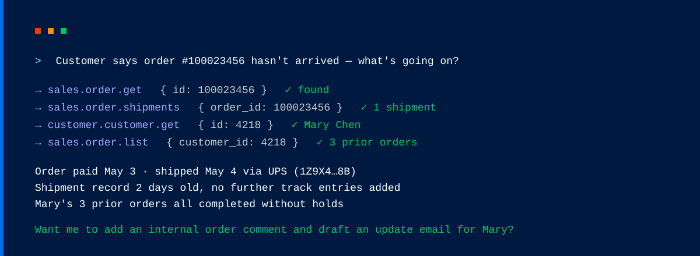

<p align="center">
  
</p>

# Magento 2 MCP module

Extensible [Model Context Protocol](https://modelcontextprotocol.io/specification/2025-06-18) server for Magento 2. Connect your store to any MCP-compatible AI agent — read and mutate customer, product, CMS or sales data, fetch reports, manage configuration, and more.

The base module ships the transport, authentication, ACL, audit log, and tool registry, plus a small set of system tools for inspecting and refreshing the store. Domain-specific functionality lives in optional sub-modules listed below — you can also write your own.

## Contents

- [What the base module gives you](#what-the-base-module-gives-you)
- [Quick start](#quick-start)
- [Installation](#installation)
- [Sub-modules](#sub-modules)
  - [Order module — `Magebit_McpOrderTools`](#order-module--magebit_mcpordertools)
  - [Catalog module — `Magebit_McpCatalogTools`](#catalog-module--magebit_mcpcatalogtools)
  - [Customer module — `Magebit_McpCustomerTools`](#customer-module--magebit_mcpcustomertools)
  - [CMS module — `Magebit_McpCmsTools`](#cms-module--magebit_mcpcmstools)
  - [Marketing module — `Magebit_McpMarketingTools`](#marketing-module--magebit_mcpmarketingtools)
  - [Report module — `Magebit_McpReportTools`](#report-module--magebit_mcpreporttools)
  - [Google Analytics module — `Magebit_McpGoogleAnalyticsTools`](#google-analytics-module--magebit_mcpgoogleanalyticstools)
- [Setup](#setup)
- [Managing tools](#managing-tools)
- [Configuration writing](#configuration-writing)
- [Connecting an AI agent](#connecting-an-ai-agent)
  - [Bearer token](#bearer-token)
  - [OAuth 2.1](#oauth-21)
- [Security](#security)
- [Extending](#extending)
- [Contributing](#contributing)

## What the base module gives you

- A `POST /mcp` JSON-RPC endpoint with bearer-token and OAuth 2.1 authentication
- Per-tool admin-role ACL and a two-layer write kill-switch
- A PII-redacting audit log with configurable retention
- Per-(admin, tool) rate limiting
- An origin allowlist with sensible defaults for major AI clients
- Core tools for the authenticated identity, cache types, indexers, store views, system configuration values and admin notifications
- Configuration writing (`system.config.set`), off by default and allowlist-only — see [Configuration writing](#configuration-writing)
- Scheduled-job diagnostics (`system.cron.status`), so the AI can answer "why didn't that run automatically?" — per-job last success/error, stuck-job detection, and per-group retention. Absent run history is not evidence a job never ran: Magento prunes successful cron rows aggressively (60 minutes by default), so `no_run_history` is normal for most of the day on any job that doesn't run every few minutes
- Read-only log diagnostics (`system.log.list` / `system.log.tail` / `system.log.grep`), so the AI can read `var/log` without shell access — basename-only, `.log` files only. Every read is bounded (line and match caps, a total byte budget) and never loads a whole file. Log lines routinely contain customer PII, tokens, or credentials, so grant the underlying tool ACLs to admin roles accordingly
- MCP prompt support (see examples in [Prompt/System](Prompt/System/) directory)

## Quick start

The fastest path from `composer require` to a connected AI is the interactive **[Quick Setup guide](https://magebitcom.github.io/magento2-mcp-module/quick-setup/)** — pick which AI you're using (Claude, ChatGPT, Cursor, Claude Code, or anything else MCP-compatible) and follow the per-client steps with copy-paste snippets and admin-screen screenshots.

Not connecting? The **[Connection Checker](https://magebitcom.github.io/magento2-mcp-module/quick-setup/diagnose.html)** probes your store's MCP endpoints from the browser and flags redirects, unreachable hosts and base-URL mismatches; the **[MCP Inspector guide](https://magebitcom.github.io/magento2-mcp-module/quick-setup/inspector.html)** walks you through verifying the OAuth sign-in and bearer-token access end to end.

For the long-form reference — every admin setting, the OAuth and bearer-token flows in detail, and the full tool catalog — see the [Wiki](https://github.com/magebitcom/magento2-mcp-module/wiki).

## Installation

```bash
composer require magebitcom/magento2-mcp-module
bin/magento module:enable Magebit_Mcp
bin/magento setup:upgrade
```

## Sub-modules

Each sub-module is published independently and depends on `Magebit_Mcp`. Install only the ones you need. After every `composer require` below, enable and rebuild Magento with:

```bash
bin/magento module:enable Magebit_Mcp<Name>Tools
bin/magento setup:upgrade
```

### Order module — [`Magebit_McpOrderTools`](https://github.com/magebitcom/magento2-mcp-order-tools)
- Read and search orders, invoices, shipments, payments, order comments and credit memos
- Create invoices, shipments, shipment tracks, credit memos and order comments
- Cancel, hold or unhold orders

```bash
composer require magebitcom/magento2-mcp-order-tools
```

### Catalog module — [`Magebit_McpCatalogTools`](https://github.com/magebitcom/magento2-mcp-catalog-tools)
- Read and search products and categories
- Create, update or delete products
- Create, update or delete categories

```bash
composer require magebitcom/magento2-mcp-catalog-tools
```

### Customer module — [`Magebit_McpCustomerTools`](https://github.com/magebitcom/magento2-mcp-customer-tools)
- Read or search customers, addresses and customer groups
- Fetch customer confirmation status
- Create, update or delete customers and addresses
- Trigger password reset or resend confirmation

```bash
composer require magebitcom/magento2-mcp-customer-tools
```

### CMS module — [`Magebit_McpCmsTools`](https://github.com/magebitcom/magento2-mcp-cms-tools)
- Read or search CMS pages and blocks
- Create, update or delete CMS pages and blocks

```bash
composer require magebitcom/magento2-mcp-cms-tools
```

### Marketing module — [`Magebit_McpMarketingTools`](https://github.com/magebitcom/magento2-mcp-marketing-tools)
- Read or search catalog rules, cart rules and coupons
- Delete, toggle and apply catalog and cart rules
- Generate or delete coupon codes

```bash
composer require magebitcom/magento2-mcp-marketing-tools
```

### Report module — [`Magebit_McpReportTools`](https://github.com/magebitcom/magento2-mcp-report-tools)
- Cart reports (products in cart, abandoned carts)
- Popular search queries and newsletter problems (bounces, send failures)
- Product reviews, review counts and average ratings
- Aggregated sales reports for orders, tax, invoices, shipments, refunds and coupons
- Customer reports (orders, totals, new customers, online visitors)
- Product reports (most viewed, bestsellers, low-stock, qty ordered, downloads)
- Dashboard summary (lifetime sales, average order, revenue for a period, recent orders, top search terms, top bestsellers)
- Refresh sales/customer/review statistics

```bash
composer require magebitcom/magento2-mcp-report-tools
```

### Google Analytics module — [`Magebit_McpGoogleAnalyticsTools`](https://github.com/magebitcom/magento2-mcp-google-analytics-tools)
- List Google Analytics accounts and GA4 properties for the connected Google account
- Inspect GA4 property details (name, currency, timezone, industry) and linked Google Ads accounts
- List a property's custom dimensions and metrics
- Run GA4 Data API reports — core, real-time (last 30 minutes) and funnel
- Read-only; authenticates to Google via OAuth with an encrypted refresh token

```bash
composer require magebitcom/magento2-mcp-google-analytics-tools
```

## Setup

Configuration lives under **Stores → Configuration → Magebit → MCP Server**. Defaults are sensible for development; review every section before going to production.

| Setting | Default | Notes |
|---|---|---|
| **General → Enable MCP Server** | Yes | Master kill-switch. When off, every request returns HTTP 503 before authentication runs. |
| **General → Server Name** | `Magento MCP` | Advertised to MCP clients during the `initialize` handshake. |
| **General → Server Description** | empty | Optional free-text hint advertised alongside the server name. |
| **General → Allow Write Tools** | Yes | Global toggle. A token's per-row write flag is only honoured when this is on. |
| **Security → Allowed Origins** | localhost + Claude, ChatGPT, Gemini, Copilot, Grok and Perplexity | One origin per line. Trailing `*` is allowed. Tighten for production. |
| **Audit Log → Retention (days)** | `90` | Older rows are purged by the `magebit_mcp_audit_purge` cron. `0` disables purging. |
| **Rate Limiting → Enabled** | No | Caps `tools/call` requests per (admin, tool) per minute. Recommended for production. |
| **Rate Limiting → Requests Per Minute** | `60` | Used when rate limiting is enabled. |
| **OAuth 2.1 → Access Token Lifetime** | `3600` (1 hour) | |
| **OAuth 2.1 → Refresh Token Lifetime (days)** | `30` | |
| **OAuth 2.1 → Authorization Code Lifetime** | `60` (seconds) | Increase only for debugging. |
| **MCP Configuration Writer → Enable Configuration Writing** | No | Master switch for `system.config.set`. See [Configuration writing](#configuration-writing). |
| **MCP Configuration Writer → Allowed Paths** | empty | The only config paths `system.config.set` may write. Empty refuses every write. |

Five separate admin-role permissions gate the module so a token-manager role need not see the audit log and vice versa:

- `Magebit_Mcp::mcp_tokens` — create, list, revoke and delete bearer tokens
- `Magebit_Mcp::mcp_oauth_clients` — manage OAuth clients
- `Magebit_Mcp::mcp_audit` — view the audit log
- `Magebit_Mcp::mcp_tool_management` — enable and disable individual tools, see [Managing tools](#managing-tools)
- `Magebit_Mcp::config` — change settings under *Stores → Configuration → Magebit → MCP Server*

Each MCP tool is also gated by its own admin-role permission under `Magebit_Mcp::tools`. Restrict admins to the subset they should be able to drive.

## Managing tools

**System → MCP → Tools** lists every registered tool with an Enable/Disable action, gated by the `Magebit_Mcp::mcp_tool_management` permission — separate from the per-tool ACLs under `Magebit_Mcp::tools`, so a role can manage which tools are available without being able to drive any of them itself.

Disabling a tool is indistinguishable on the wire from the tool never having existed: it drops out of `tools/list`, and a `tools/call` for it returns the same `-32010 TOOL_NOT_FOUND` error, with the same message, that an unregistered tool name would produce. This is deliberate — probing the tool surface tells a client nothing about which tools exist but are switched off. The guarantee covers that surface only: a prompt body that names a tool goes on naming it whether or not the tool is currently disabled.

The disabled set is stored as a newline-separated list of tool names at `magebit_mcp/tools/disabled` (default/global scope). It is written only from the Tools page, not exposed as a field under *Stores → Configuration*, and `system.config.get` refuses to read it back — the whole `magebit_mcp/*` section is off limits to the config reader, just as it is to the writer.

`bin/magento magebit:mcp:tools:list` deliberately keeps listing disabled tools: it reports what the installed modules register, and the switch governs what the MCP endpoint serves, not what an operator on the command line can see.

## Configuration writing

`system.config.set` writes a single store-configuration value. It is the only tool that can change how the store behaves without touching the catalog, so it is gated more tightly than anything else in the module.

**Both write layers still apply first.** Like every write tool it needs *General → Allow Write Tools* **and** the calling token's own write flag, plus the `Magebit_Mcp::tool_system_config_set` ACL on the admin role behind the token. On top of that:

| Gate | Where | Effect |
|---|---|---|
| **Enable Configuration Writing** | *MCP Configuration Writer → Enable* | Off by default. Off means every call is refused. |
| **Allowed Paths** | *MCP Configuration Writer → Allowed Paths* | Exact paths, one per line, no wildcards. **Empty refuses every write** — enabling the tool and choosing what it may change are two separate decisions. |
| **Protected set** | code (DI), not admin config | Refused whatever the allowlist says. |
| **`system.xml` field** | Magento's own config structure | A path with no field declared in `system.xml` is refused. |
| **Section ACL** | the target section's own `<resource>` | The admin role behind the token must also hold the permission that guards that section in the admin UI. A section that declares no `<resource>` is refused outright — the admin UI refuses to save it for every role, so the tool does too. |

The write itself goes through Magento's admin save path, so the field's backend model, validation and cache invalidation run exactly as they would in *Stores → Configuration*. The result and the audit row both carry the previous value, which is the only undo trail a config change gets. As in the admin UI, Magento commits the row *before* it dispatches the section's `admin_system_config_changed_section_*` observers, so an observer that fails is reported as a tool error against a value that was in fact written.

**The protected set** is `admin/*`, `payment/*` (including Magento_Paypal's `payment_<country>` alias sections), `web/secure/*`, `web/unsecure/*`, `system/*`, `dev/*`, `oauth/*` and `magebit_mcp/*`. It lives in `di.xml`, not in store configuration, so weakening it takes filesystem write access plus `bin/magento setup:di:compile` — neither an admin session nor the MCP surface itself can widen it. `magebit_mcp/*` is on the list for exactly that reason: without it the tool would be a one-call privilege escalation, able to add paths to its own allowlist or flip *Allow Write Tools*.

Password, encrypted and obscured fields are refused as well, as are file- and image-upload fields (a plain value would be discarded by the field's backend model while the save still reported success), paths whose `system.xml` field stores its value somewhere else (`<config_path>`) and paths pinned in `app/etc/env.php` or by a `CONFIG__*` environment variable — the last two would report a change Magento silently skipped.

**Not everything in `core_config_data` is writable, by design.** A stock install declares roughly 11,000 field paths and the gates above refuse the great majority of them, whatever the allowlist says: most store their value under a different `<config_path>`, are not declared in `system.xml` at all, or are a password, an obscured value or a file upload. Allowlisting such a path does not help — the refusal is not the allowlist's. The most common surprise is the `design/*` family (`design/header/logo_alt`, `design/head/default_title`, …): those are Design Configuration entries under *Content → Design → Configuration*, not `system.xml` fields, so they are refused as undeclared. Use the admin UI for them.

**Reading is a separate, wider surface.** `system.config.get` returns the *effective* value, merged from `config.xml` module defaults, so a path with no `core_config_data` row still reports a value. Reading the same path straight from the database, or with `bin/magento config:show`, returns nothing — that difference is expected and does not mean the setting is unset.

## Connecting an AI agent

Two authentication paths. Bearer tokens are simplest; OAuth 2.1 is the right choice for hosted MCP clients (Claude, ChatGPT) that ask the operator to consent.

### Bearer token

Mint a token from the CLI (or from **System → MCP → Connections** in the admin):

```bash
bin/magento magebit:mcp:token:create \
  --admin-user <username> \
  --name "<label>" \
  [--allow-writes] \
  [--expires "+30 days"] \
  [-s <tool.name>] [-s <tool.name>]
```

The plaintext is printed once and is never recoverable afterwards — store it securely. Manage tokens with:

```bash
bin/magento magebit:mcp:token:list [-u <username>]
bin/magento magebit:mcp:token:revoke <id>   # day-to-day; preserves the audit trail
bin/magento magebit:mcp:token:delete <id>   # hard-delete
```

Configure your MCP client with:

| Setting | Value |
|---|---|
| URL | `https://<your-store>/mcp` |
| Authorization header | `Bearer <token>` |

### OAuth 2.1

Manage OAuth clients under **System → MCP → OAuth Clients**. The module exposes:

| Endpoint | Purpose |
|---|---|
| `GET /.well-known/oauth-authorization-server` | Authorization-server metadata (RFC 8414). |
| `GET /.well-known/oauth-protected-resource` | Protected-resource metadata (RFC 9728). |
| `GET\|POST /mcp/oauth/authorize` | Interactive consent screen. Requires admin sign-in. |
| `POST /mcp/oauth/token` | Token endpoint (`authorization_code` and `refresh_token` grants). |

Two scopes are advertised:

- `mcp:read` — invoke read-only tools
- `mcp:write` — also invoke write tools (still subject to the global write toggle)

Each OAuth client has its own scope cap and the consenting admin can narrow further at the consent screen. OAuth-issued tokens land in the same Connections list as bearer tokens, so you manage and revoke them in one place.

## Security

- **Two authentication paths.** Bearer tokens issued by an admin, and OAuth 2.1 with mandatory PKCE.
- **Origin allowlist.** Configurable; defaults cover only loopback and the major AI surfaces. Tighten for production.
- **Per-tool admin-role ACL.** Every tool resolves through Magento's standard role permissions — MCP can never do what the admin UI would forbid.
- **Two-layer write gating.** Write tools require the global *Allow write tools* toggle *and* a per-token (or per-OAuth-scope) write flag.
- **Allowlisted configuration writing.** `system.config.set` is off by default and can only write the exact paths an admin lists; a protected set defined in code — including the module's own settings — is refused whatever the allowlist says. See [Configuration writing](#configuration-writing).
- **Confirmation hint for destructive tools.** Write tools may flag themselves as requiring confirmation; clients that support it (e.g. Claude Desktop) prompt the operator.
- **Per-(admin, tool) rate limiter.** Off by default; recommended for production.
- **Audit log.** Every request is recorded — even unauthenticated attempts. Argument values are PII-redacted before storage.
- **Separated admin permissions.** Token management, OAuth-client management, audit-log viewing, tool management and module configuration are five distinct ACLs.

If you discover a security issue, please report it privately to [info@magebit.com](mailto:info@magebit.com) rather than opening a public issue.

## Extending

Write your own tools and prompts by implementing `Magebit\Mcp\Api\ToolInterface` (or `PromptInterface`) and registering them via `di.xml`. The six sub-modules listed above are full worked examples.

The contract surface is:

1. Implement `Magebit\Mcp\Api\ToolInterface` and declare an ACL resource for the tool. By convention, dots in the tool name become underscores in the ACL id (`catalog.product.get` → `Vendor_Module::mcp_tool_catalog_product_get`).
2. Register the tool in `di.xml` under `Magebit\Mcp\Model\Tool\ToolRegistry`. The DI key must match the tool's `getName()` and conform to `^[a-z][a-z0-9_]*(\.[a-z][a-z0-9_]*)+$`.
3. For write tools that wrap a Magento service contract, optionally implement `Magebit\Mcp\Api\UnderlyingAclAwareInterface` so the dispatcher also enforces the equivalent admin-UI permission.
4. Run `bin/magento magebit:mcp:tools:validate-acl` to confirm every tool's ACL resource resolves.

See [docs/EXTENDING.md](docs/EXTENDING.md) for the full contract, the schema-builder DSL, schema presets, the field-resolver pattern, lifecycle events, and a complete worked example.

## Contributing

Found a bug, have a feature suggestion or want to help? Contributions are very welcome — open an issue or pull request on GitHub.

---


*Have questions or need help? Contact us at info@magebit.com*
